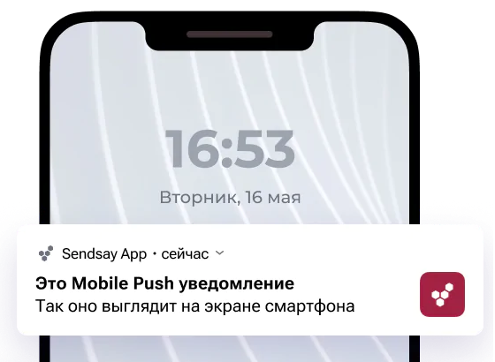
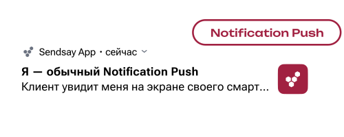
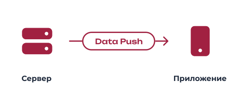

# Мобильные пуш-уведомления: что это и как они работают  

    Мобильные пуш-уведомления - это короткие мгновенные уведомления, которые всплывают у пользователя на главном экране смартфонов.

  

    

#### Для чего нужны мобильные пуш-уведомления?
Главная цель мобильных push уведомлений - привлечение новой аудитории и оповещение пользователей приложения об интересных новостях, акциях, услугах и записях.

#### Как работают мобильные пуш-уведомления?

Мобильные пуш-уведомления отправляются только тем пользователям, кто установил мобильное приложение или электронную карту лояльности, а так же разрешил отправлять такие оповещения. Их можно отправлять на любые телефоны, кроме кнопочных. Такой формат поддерживает и iOS, и Android.  

С техническй точки зрения, мобильные пуш-уведомления работают следующим образом:

1. пользователь устанавливает приложение на устройство;
2. выдаётся запрос прав на отправку уведомлений, и в случае успеха - ОС получает идентификатор устройства у службы пуш-уведомлений;
3. операционная система передаёт идентификатор на сервер для подключения к уведомлениям;
4. сервер шлёт уведомления при наступлении определенного события.  

Существуют два типа сообщений:
1) **Notification push** - помогут доставить ваше сообщение клиенту на главный экран смартфона.
Когда пользователь получает пуш-уведомление на свой смартфон, он смахивает его в сторону, в случае если предложение его не заинтересовало, в ином случае переходит в приложение, при помощи клика на пуш-уведомление, если оно показалось ему интересным или важным. 

    

2) **Data push** - отправят команду приложению, не отображаясь на экране пользователя. 

    

В случае выключения уведомлений пользователем, сообщения доходить не будут.
 

[Платформа Sendsay](https://sendsay.ru/features/mobilnye-push-uvedomleniya) предоставляет возможность подключения мобильных пуш-уведомлений, для вашего бизнеса.
